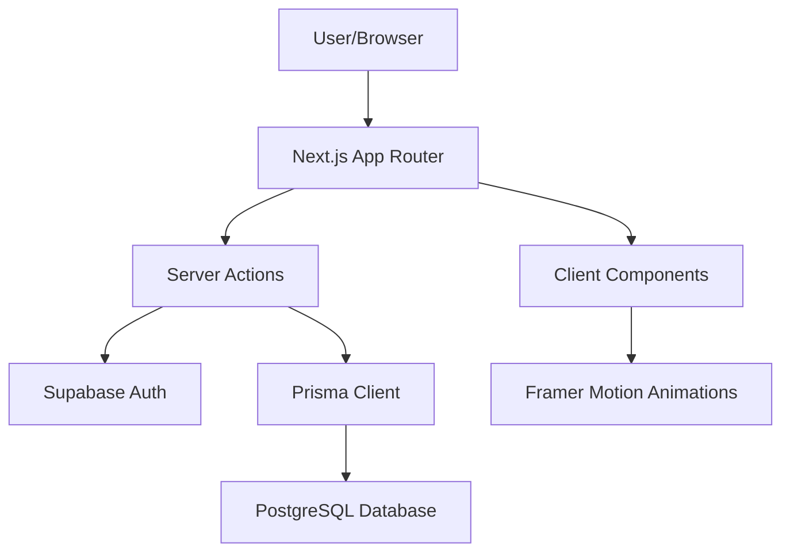

# 🏆 Funded Masters

**Empowering Traders with Capital and Expertise.**  
*A high-performance prop-trading platform built for the next generation of financial masters.*

---

## 💎 Project Overview

**Funded Masters** is a premium prop-firm platform designed to provide talented traders with the capital they need to scale. With a focus on high-fidelity UI, seamless user experience, and robust backend integration, it bridges the gap between ambition and institutional funding.

## 🚀 Tech Stack

- **Frontend**: [Next.js 14](https://nextjs.org/) (App Router)
- **Styling**: [Tailwind CSS](https://tailwindcss.com/)
- **Animations**: [Framer Motion](https://www.framer.com/motion/)
- **Auth**: [Supabase Auth](https://supabase.com/auth)
- **Database**: [PostgreSQL](https://www.postgresql.org/) (via Supabase)
- **ORM**: [Prisma](https://www.prisma.io/)
- **Icons**: [Lucide React](https://lucide.dev/)

## ✨ Key Features

- 🟢 **Pixel-Perfect UI**: Strictly adhered to high-fidelity Figma designs.
- 🔐 **Secure Auth**: Full registration and login flow using Supabase.
- 📊 **Dynamic Dashboard**: Real-time account metrics and challenge tracking.
- 📱 **Fully Responsive**: Optimized for desktop, tablet, and mobile.
- ⚡ **Proprietary Logic**: Built-in logic for tracking challenge progress and account status.

## 🏗️ Architecture



## 🛠️ Local Setup

1. **Clone the repo**:
   ```bash
   git clone https://github.com/your-username/funded-masters.git
   ```

2. **Install dependencies**:
   ```bash
   npm install
   ```

3. **Environment Variables**:
   Copy `.env.example` to `.env` and add your keys.

4. **Database Setup**:
   ```bash
   npx prisma generate
   npx prisma db push
   ```

5. **Run the engine**:
   ```bash
   npm run dev
   ```

---

*Built with precision by the Funded Masters Team.*
