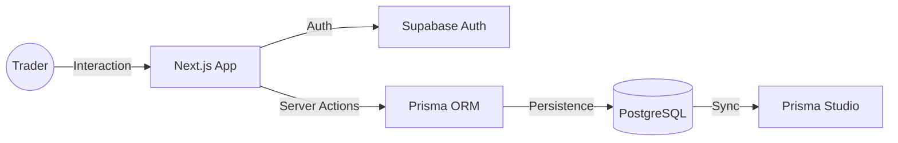

<div align="center">


# 🏆 FUNDED MASTERS
### The Premier Prop-Firm Platform for Elite Traders

[](https://nextjs.org/)
[](https://www.typescriptlang.org/)
[](https://tailwindcss.com/)
[](https://supabase.com/)
[](https://www.prisma.io/)

---

**Empowering talent with institutional capital. Precision engineered for high-performance trading.**

[Explore the Platform](http://localhost:3000) • [Start a Challenge](http://localhost:3000/auth/register) • [Trader Login](http://localhost:3000/auth/login)

</div>

## 🌌 The Vision
Funded Masters isn't just another prop-firm; it's a **state-of-the-art trading ecosystem**. We provide the infrastructure, security, and capital that allows traders to focus on what they do best: *mastering the markets.*

## ✨ High-End Features

| Feature | Description |
| :--- | :--- |
| 💎 **Ultra-High Fidelity** | Pixel-perfect implementation of premium Figma designs. |
| 🔐 **Elite Security** | Enterprise-grade Auth via Supabase with real-time session management. |
| 📊 **Pro Dashboard** | Advanced account tracking, profit metrics, and challenge status. |
| ⚡ **Zero Latency** | Optimized with Next.js Server Components for lightning-fast performance. |
| 📱 **Adaptive Layout** | A seamless experience across mobile, tablet, and ultra-wide displays. |

## 🛠️ Tech Stack Architecture

### **Core Infrastructure**
- **Framework**: Next.js 14 (App Router)
- **Styling**: Tailwind CSS (Custom Dark Theme)
- **Animations**: Framer Motion (Micro-interactions & Smooth Transitions)

### **Backend & Data**
- **Backend-as-a-Service**: Supabase
- **ORM**: Prisma 6 (Stable)
- **Database**: Managed PostgreSQL
- **Security**: JWT & Cookie-based sessions

## 🏗️ System Flow



## 🚀 Quick Start

### 1️⃣ Clone & Install
```bash
git clone https://github.com/yourusername/funded-masters.git
cd funded-masters
npm install
```

### 2️⃣ Configure Secrets
Create a `.env` file based on `.env.example`:
```env
DATABASE_URL="your-postgresql-url"
NEXT_PUBLIC_SUPABASE_URL="your-url"
NEXT_PUBLIC_SUPABASE_ANON_KEY="your-key"
```

### 3️⃣ Initialize Engine
```bash
npx prisma generate
npx prisma db push
npm run dev
```

---

<div align="center">
  <p>Built with ❤️ by <b>Rushikesh Randive</b></p>
  
  
</div>
